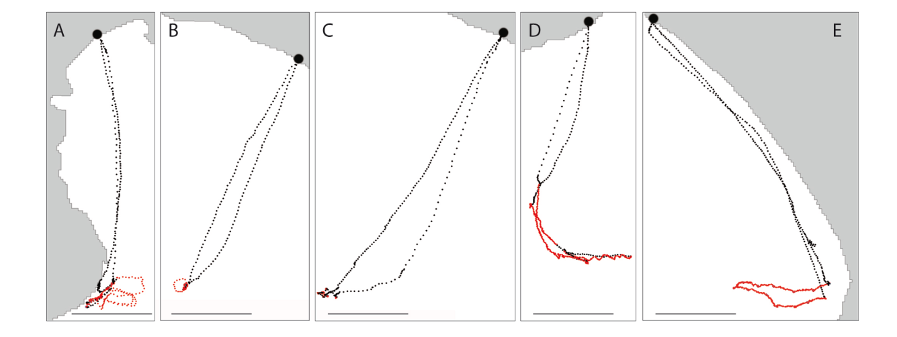
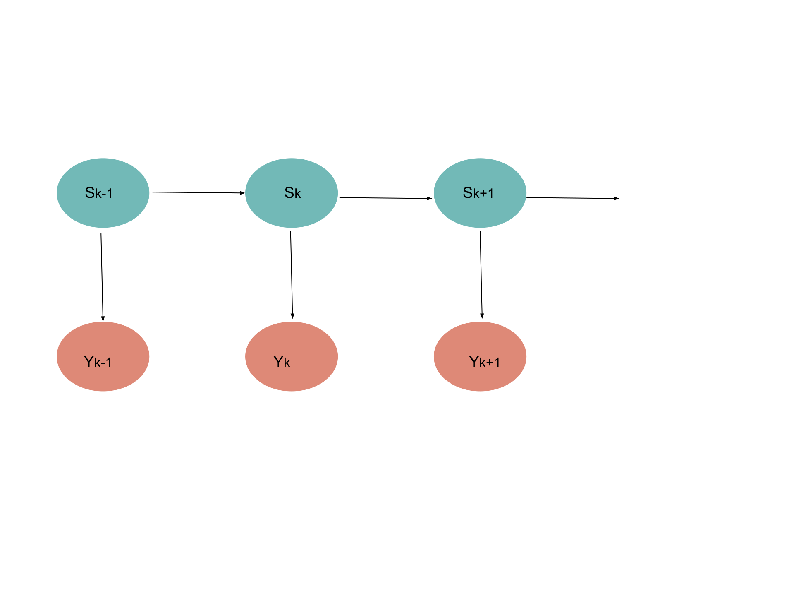
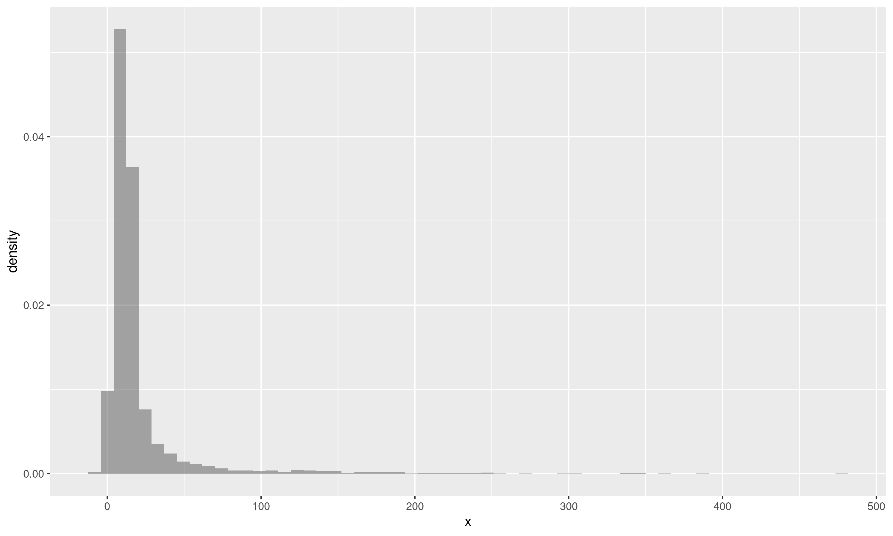
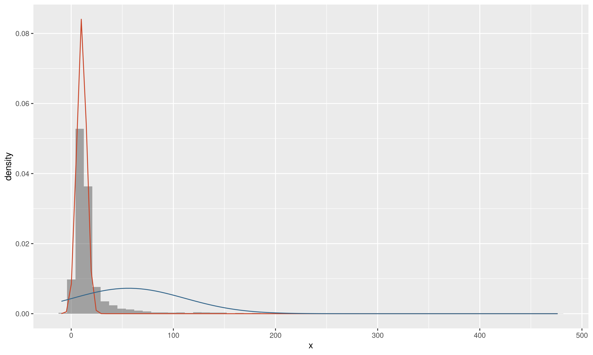
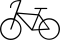

name: intro

<!-- F1D763 -->
<!-- F7A913 -->
<!-- C94326 -->
<!-- 1F908E -->
<!-- 33658A -->


```{r setup, include = FALSE,  eval = TRUE, message=FALSE, include=FALSE}
library(tidyverse)
library(wesanderson)
library(ggpubr)
library('RefManageR')
main_dir <-  '..'
common_img_dir <- file.path(main_dir,'courses_tools','resources', 'common_figs')
course_img_dir <- file.path(main_dir,'resources', 'figs')
BibOptions(check.entries = FALSE,
           bib.style = "authoryear",
           cite.style = "authoryear",
           style = "markdown",
           hyperlink = TRUE,
           max.names = 3,
           longnamesfirst= FALSE, 
           dashed = TRUE)
myBib <- ReadBib('biblio_soutenance.bib', check = FALSE)
```

```{r xaringan-fit-screen, echo=FALSE}
xaringanExtra::use_fit_screen()
```

<!-- # Why do I enjoy research in statistics  ? -->
<!-- -- -->


<!-- <div class= "addspace"> -->
<!-- <li> Working with researchers from different background,</li> -->
<!-- </div> -->

<!-- <div class= "addspace"> -->
<!-- <li> Never left the school system, </li> -->
<!-- </div> -->


<!-- <div class= "addspace"> -->
<!-- <li> Continnuously learning new concepts, methods, tools  </li> -->
<!-- </div> -->

<!-- <div class= "addspace"> -->
<!-- <li> being confortable with my inside geek part.  </li> -->
<!-- </div> -->


# Movement ecology paradigm

##  `r Citep(myBib, 'nathan2008movement')` presents individual movement as the results of

.left-column[
<figure>
  
</figure>
.legend[  Movement drivers by `r Citet(myBib, "nathan2008movement")` ]
]

.right-column[

* Motion capacities
* Internal state
* Environment
]
  
--

.question[Movement informs on internal states and habitat preferences]

---
name: move2data
# From Movement to Movement data


--


.pull-left[
<figure>
  
</figure>
]

---
template: move2data
count: false


.pull-left[
<figure>
  
</figure>
]


---
template: move2data
count: false


.pull-left[
<figure>
  
</figure>
]

---
template: move2data
count: false


.pull-left[
<figure>
  
</figure>
]

--

.pull-right[
A continuous process sampled at some discrete potentially irregular times.

Time series with values in $\mathbb{R}^2$ (on earth ...).

$$\begin{array}\\ 
 \mbox{Time} & \mbox{Location} & \mbox{Turning angle} & \mbox{Speed}\\
t_{0} & (x_0, y_0) & NA & NA\\
t_{1} & (x_1, y_1) & NA & sp_1\\
t_{2} & (x_2, y_2) & ang_2 & sp_2\\
\vdots & \vdots& \vdots& \vdots \\
t_{n} & (x_n, y_n) & ang_n & sp_n\\\\
\end{array}$$
]


---
# Ecological questions 

## Identifying various movement patterns 

.pull-left[

Rarely in a supervised context

<figure>
  
.legend[Artisanal fishing trips in Toliara, Madagascar]
</figure>
]


.pull-left[

Mostly unsupervised

<figure>
  
.legend[Peruvian booby  data courtesy of Sophie Bertrand]
</figure>
]


---
# Ecological questions 

## Understanding space use


.pull-left[


<figure>
  
.legend[Spatial dives repartition, from `r Citep(myBib, "johnson2011bayesian")` ]
</figure>
]

--

.pull-right[

## and the link with environmental characteristics

<figure>
  
.legend[Sea Lions habitat description]
</figure>
]


---
name: data2model
# From Movement Data to Movement Model

--

Often analysed using discrete time model  `r Citep(myBib, "mcclintock2014discrete")`

--

<figure>
  
.legend[Movement decomposition]
</figure>


---
name:signal

# Signal processing methods 

--

##  Heterogeneity in movement pattern interpretated as different internal states

.pull-left[
<figure>
  
.legend[Peruvian booby  data courtesy of Sophie Bertrand]
</figure>

<figure>
  
.legend[Movement decomposition]
</figure>

]

--

.pull-right[
```{r illust_profil_1, echo = FALSE}
set.seed(6)
N <- 200
change.point <- round(cumsum(rexp(N, rate = 0.03)+10))
change.point <- change.point[which(change.point<N)]

## state sequence 
l1 <- Reduce("+", lapply(c(1,change.point), function(d){
 return( 1*(d<=(1:N) ))}))

Nchange <- length(change.point)
mu_1 <-rnorm(Nchange+1, mean=5, sd=2)
mu_2 <-rnorm(Nchange+1, mean=0, sd=pi/4)
sigma_1 <- 1/rgamma(Nchange+1, shape = 20,rate = 10)                                  
sigma_2 <- 1/rgamma(Nchange+1, shape = 40,rate = 20)                                  
signal_1 <- rnorm(N, mean=mu_1[l1], sd=sigma_1[l1])
signal_2 <- rnorm(N, mean=mu_2[l1], sd=sigma_2[l1])
traj_dta <- tibble(desc1 =signal_1, desc2= signal_2, seg = l1, index = 1:N) %>% mutate(mu1 = mu_1[l1], mu2 =mu_2[l1])
p1 <- traj_dta %>%  ggplot() + aes(x= index, y =desc1) + geom_point(col= "#C94326") + xlab("")
p2 <- traj_dta %>%  ggplot() + aes(x= index, y =desc2) + geom_point(col= "#33658A") + xlab("")
p_complete <-ggarrange(p1,p2, nrow = 2 )
p_complete
```

]


---
template:signal


##  Heterogeneity in movement pattern interpretated as different internal states

.pull-left[
<figure>
  
.legend[Peruvian booby  data courtesy of Sophie Bertrand]
</figure>

<figure>
  
.legend[Movement decomposition]
</figure>

]


.pull-right[
```{r illust_profil_2, echo = FALSE}
p1_2 <- p1 + geom_line(aes(x=index, y = mu1), col = "#C94326" )
p2_2 <-  p2 + geom_line(aes(x=index, y = mu2), col = "#33658A" )
p_complete_2 <-ggarrange(p1_2,p2_2, nrow = 2 )
p_complete_2
```
]

---
template:signal

.pull-left[
## Accounting for internal states

 * Change point detection approach. `r Citep(myBib, "patin2019identifying")` based on `r Citep(myBib, "picard2007segmentation")`

<figure>
  
.legend[Segmentation illustration `r Citep(myBib, "patin2019identifying")`]
</figure>

]

.pull-left[

$$\left .\begin{array}{c}
Y_{1k} \sim f(\theta_{1\ell})\\
Y_{2k} \sim f(\theta_{2\ell})
\end{array} \right\rbrace \mbox{ if } k \mbox{ in region }I_{\ell}=[\tau_{\ell-1}+1,\tau_{\ell}]$$

The best segmentation for a given number of change points L:
$$argmin_{0< \tau_1 < \ldots < \tau_L} C(\boldsymbol{Y}) $$
--
Brute force  complexity : $O(N^L)$,

Dynamic Programming algorithm complexity : $O(N^2)$ or even less with pruning strategy


Limitation in the choice for $f.$
]


---
template:signal

.pull-left[
## Accounting for internal states

 * Change point detection approach. `r Citep(myBib, "patin2019identifying")` based on `r Citep(myBib, "picard2007segmentation")`


<figure>
  
.legend[Segmentation - classification illustration`r Citep(myBib, "patin2019identifying")`]
</figure>
]

.pull-left[

$$\left .\begin{array}{c}
Y_{1k} \sim f(\theta_{1a})\\
Y_{2k} \sim f(\theta_{2a})
\end{array} \right\rbrace \mbox{ if } k \mbox{ in }I_{\ell}, \mbox{ and } S_l = a$$


Dynamic Programming algorithm and mixture model. 

]

---
template:signal


##  Heterogeneity in movement pattern interpretated as different internal states


.left-column[
## Accounting for internal states

 * More classically addressed with Hidden Markov Model `r Citep(myBib, c("morales2004extracting", "walker2010pioneer", "gurarie2009novel", "michelot2016movehmm"))`

<figure>
  
</figure> 

]

.right-column[
$$Y_k \vert S_{k} = i \overset{i.i.d}{\sim} \mathcal{L}(\theta_i),$$
$$S_0 \sim \nu_0, \quad \mathbb{P}(S_k =j \vert S_{k-1} = i) = \pi_{ij}$$
]


Inference with the EM algorithm, example the estimation of the mean of normal distribution 
$$\hat{\theta_i}^{s+1}= \frac{1}{\sum_{k=1}^{n}\tau_{ik}^s} \tau_{ik}^s Y_k, \quad \tau_{ik}^s =P_{\theta^s}(X_k=i\vert Y_{0:n})$$


--

In `r Citep(myBib, c( "michelot2016movehmm"))`, 

$$\mathbb{P}(S_k =j \vert S_k = i, Cov_{i}) \propto \exp \left \lbrace \beta Cov_i \right \rbrace$$


---
template: signal

### Choosing the number of hidden states

* Typically using likelihood based criteria  AIC, BIC ICL 


.question[`r Citep(myBib, "pohle2017selecting")` advocate that likelihood based criteria tend to overestimate the number of components and this number should be chosen according to biological considerations.]


The main suspect : the strong parametric form of the emission model in classical HMM model in ecology 


```{r, echo = FALSE, message=FALSE, warning=FALSE}
dta <- tibble(x=rgamma(5000, shape=0.1, rate = 0.01)+
                rnorm(5000, mean =10, sd=5)
                )   %>% arrange(x) %>% rowid_to_column() %>% mutate(cl=ifelse(rowid< 800*5, 1, 2))
theta <- dta %>% group_by(cl) %>% summarize(m = mean(x), s = sd(x))
p1 <- dta %>% ggplot() + aes(x=x) + geom_histogram(aes(y = after_stat(density)), alpha = 0.5, bins =60) 
ggsave(filename = "p1.png", width = 10, height = 6)
p2 <- p1 +
  stat_function(fun = dnorm, args = list(mean = theta$m[1], sd = theta$s[1]), col = "#C94326") +
  stat_function(fun = dnorm, args = list(mean = theta$m[2], sd = theta$s[2]), col = "#33658A") 
ggsave(filename = "p2.png", width = 10, height = 6)  
```
.pull-left[
<figure>
  
</figure> 
]

--
.pull-right[
<figure>
  
</figure> 
]

--

A new hope: new non parametric approaches have been proposed `r Citep(myBib, "lehericy2019consistent", "dechaumaray2022estimation")`


---

# Movement path is more than time series, importance of considering the space.


.center[.care[Proposing ecologically meaningful movement models]]

Pros and cons of  Discrete time versus continuous time movement models  discussed in `r Citet(myBib, 'mcclintock2014discrete')` 

.pull-left[ Discrete time models

* .bleu[Simple models,]
* .bleu[Numerous well established methods,]
* .rouge[Interpretation depends on the sampling process,]
* .rouge[Coping with Irregular sampling is not straightforward.]


]

.pull-right[
Continuous time models

* .rouge[Complex models,]
* .rouge[Inference not so easy,]
* .bleu[Interpretation independant  from the sampling process,]
* .bleu[Irregular sampling is theoretically straightforward.]

]
---

# Potential based Diffusions as continuous time movement model 

Let  $(X_s)_{s\geq0}\in\mathbb{R}^2$ denote the position at time $s$.

.pull-left[
* Brownian motion: a pure diffusion model
$$dX_s = dW_s, \quad X_0=x_0.$$
<figure>
  
</figure>
]

--
.pull-left[
* Ornstein Uhlenbeck process: central place behavior
$$dX_s = -B (X_s- \mu) ds + dW_s, \quad X_0=x_0.$$

<figure>
  
</figure>
]


Popular models as  Brownian Motion and Ornstein Uhlenbeck have known transition densities 
$q(x_t, x_{t+s})$ which is not the case in general.

---


# Potential based Diffusions as continuous time movement model 

`r Citet(myBib,'brillinger2002employing')` propose a flexible framework
$$dX_s = -\nabla H_{\theta}(X_s) ds + \gamma dW_s, \quad X_0=x_0.$$

but no explicit transitions $q_{\theta}(x_t, x_{t+s}),$ .care[ No explicit likelihood!]

--

In `r Citet(myBib,'Gloaguen2018stochastic')`, as part  of *P. Gloaguen's PhD*, explore $H_{\theta}(X_s) = \sum_{k=1}^K \pi_k \varphi_k(X_s),$

.pull-left[
<figure>
  
  .legend[One example for $H_{\theta}$]
</figure>
]

--

.pull-right[
* Euler approximation : biased estimates with low frequency data
* `r Citep(myBib, 'ozaki1992bridge')` and `r Citet(myBib,'kessler1997estimation')` same results than
* MCEM based on exact simulation `r Citep(myBib, 'beskos2006exact')` limits the flexibility of the SDE.
]
--

Stationarity, if meaningful the stationnary distribution is given by  

$$\pi_{\theta}(x) \varpropto e^{- \frac{2}{\gamma^2} H_{\theta}(x)}.$$ 


<!-- --- -->

<!-- # Potential based Diffusions as continuous time movement model  -->

<!-- ## Flexible movement model for habitat preference -->


<!-- <figure> -->
<!--    -->
<!--    .legend[Flexible movement model which accounts for environment] -->
<!-- </figure> -->


<!-- --- -->
<!-- template: movement -->
<!-- ## Flexible movement model -->

<!-- <figure> -->
<!--    -->
<!--    <figcaption> Flexible non homogeneous movement model</figcaption> -->
<!-- </figure> -->


---

# Potential based Diffusions as continuous time movement model 

## Flexible movement model for habitat preference

A classical choice of **resource selection function**, (i.e stationary distribution including covariates)
$$\pi{\left(x \vert \theta\right)} \varpropto  \exp\left(\sum_{j=1}^J \theta_j c_j (x) \right). $$ 

--

Combining the ideas of `r Citep(myBib, "michelot2019linking")`, and  `r Citep(myBib, "brillinger2002employing")` lead to the Langevin diffusion as movement model, 
$$d X_t = \frac{\gamma^2}{2} \nabla \log \pi_{\theta}{\left(X_t\right)} \, d t + \gamma \,d W_t,\quad X_0 =x_0.$$
--

Using Euler approximation 

$$	X_{i+1} \vert \lbrace X_i = x_i \rbrace = 
    	x_i + \frac{\gamma^2 \Delta_i}{2} \sum_{j=1}^J \theta_j \nabla c_j(x_i) + \sqrt{\Delta_i}  \varepsilon_{i+1},\quad 
    	\varepsilon_{i+1} \overset{ind}{\sim} N \left( {0} , \gamma^2 \boldsymbol{I}_d \right),$$
---

# Potential based Diffusions as continuous time movement model 

## Flexible movement model for habitat preference

$${\Delta_i}^{-1/2} 	(X_{i+1} - X_i)  \overset{i.i.d}{\sim} \mathcal{N}\left( Z_i \theta, \gamma^2 I_2\right),$$
leads to a simple linear model published in `r Citet(myBib,"michelot2019langevin")`.
    	
--

.pull-left[
<figure>
  
.legend[Sea Lions habitat description]
</figure>
]

--

.pull-right[

<figure>
  
.legend[Sea Lions habitat description]
</figure>
]

--

Straightforward to consider a HMM  assuming that the state is constant over $\Delta_i$:

The derived EM algorithm just requires to fit a weighted linear regression with weight $\class{rouge}{\tau_{ik}^s =P_{\theta^s}(X_k=i\vert Y_{0:n})}.$


.small[ On going work on Sea birds in the Mediteranean sea and Roe deer next to Toulouse]

---
name: POD
# Potential based Diffusions as continuous time movement model 


## Partially observed SDE 
.pull-left[
  
]


.pull-right[

Let  $Y_k$ be the recorded position $s_k$, a noisy observation of the true position $X_k$:

$$dX_s = b_{\theta}(X_s) ds + \gamma dW_s, \quad X_0=x_0;$$
$$Y_k \overset{ind}{\sim} g_{\theta_o} (X_k).$$
]

--

<figure>
  
.legend[DAG representation]
</figure>


---
template:POD

### Estimation key quantity : additive smoothing distributions in E Step

$$\sum_{k=0}^{n-1}\mathbb{E}( h(X_k, X_{k+1}) \vert Y_{0:n})$$
---
name: POD2
# Potential based Diffusions as continuous time movement model 


## Sequential method for fltering distribution : $\mathbb{E}( M(X_k) \vert Y_{0:k})$.

--
<figure>
  
.legend[Particle Filter]
</figure>

---
template: POD2

###  The problem with POD processes

* $q^\theta(x, y, \Delta)$ can't be computed (even when $\theta$ is known);
* This quantity is crucial for weights computation.

--

### General Poisson estimator ( `r Citet(myBib, "fearnhead2008particle")` )

Under some assumptions, there exists an unbiased estimator $\class{\orange}{\hat{q}^\theta(x_k,x_{k+1},\Delta_k,\zeta_k)}$ such that 

$$\class{orange}{\hat{q}^\theta(x_k,x_{k+1},\Delta_k,\zeta_k)}>0\text{ and } \mathbb{E}[\class{orange}{\hat{q}^\theta(x_k,x_{k+1},\Delta_k,\zeta_k)}] =q^\theta(x_k,x_{k+1},\Delta_k)$$

$\class{orange}{\zeta_k}$ is a random variable requiring simulation of constrained Brownian bridges.
--

 
### New filtering weights
${\omega_k^i=\frac{g_1^\theta(\xi_k^i)q^\theta(\xi_{k-1}^{I_{k}^i},\xi_k^i, \Delta_{k-1})}{p^\theta(\xi_{k-1}^{I_{k-1}^i},\xi_k^i, \Delta_{k-1})}}$ is replaced by $\class{orange}{\hat{\omega}_k^i}=\frac{g_1^\theta(\xi_k^i)\class{orange}{\hat{q}^\theta(\xi_{k-1}^{I_{k}^i},\xi_k^i, \Delta_{k-1}, \zeta_{k-1})}}{p^\theta(\xi_{k-1}^{I_{k-1}^i},\xi_k^i, \Delta_{k-1})}$ 

---
name: POD3
# Potential based Diffusions as continuous time movement model 


## Sequential method for smoothing distribution : $\mathbb{E}( h(X_k, X_{k+1} ) \vert Y_{0:k})$.

--

<figure>
  
.legend[Particle Filter]
</figure>

---
template: POD3


### Main problem
Backward smoothing requires to sample an ancestor (value of $j$) with weights:
$${\Lambda_{k-1}^{j,i}}\varpropto {\hat{\omega}_{k-1}^j}q^\theta(\xi_{k-1}^j,\xi_k^i, \Delta_{k-1}).$$

The probability of $\xi_{k-1}^j$ being the ancestor of $\xi_{k}^i$ under the true dynamics

--

### The solution? (When $q^\theta$ can't be computed) 
Use the unbiased estimator $\class{orange}{\hat{q}^\theta(\xi_{k-1}^{j},\xi_k^i, \Delta_{k-1}, \zeta_i)}$ as a substitute:
$${\hat{\Lambda}_{k-1}^{j,i}}= \frac{\hat{\omega}_{k-1}^j\class{orange}{\hat{q}^\theta(\xi_{k-1}^{j},\xi_k^i, \Delta_{k-1}, \zeta_i)}}{\sum_{\ell=1}^N \hat{\omega}_{k-1}^\ell \class{orange}{\hat{q}^\theta(\xi_{k-1}^{j},\xi_k^i, \Delta_{k-1}, \zeta_i)}}$$

But  $\mathbb{E}({\hat{\Lambda}_{k-1}^{j,i}}) \ne {\Lambda}_{k-1}^{j,i},$ because of the ratio.
---

template: POD3

The Acceptance Rejection tricks used in standard SSM `r Citep(myBib,"douc2011sequential")`

### First ingredient 

.care[Assumption:] $\exists \class{orange}{\hat{\sigma}_{k,+}}$ such that $\forall x,y,~0< \class{orange}{\hat{q}^\theta(x,y,\Delta_k,\zeta_k)}< \class{orange}{\hat{\sigma}_{k,+}}$  a.s.

Consider the random variable $\class{bleu}{\widehat{J}}$ defined as follow:

* Sample $J_{cand}\in 1,\dots, N$ with probabilities  $\propto {\{\hat{\omega}_{k-1}^i\}_{i=1,\dots,N}}$;
* Sample $\class{orange}{\zeta_{k-1}}$ using the GPE of `r Citep(myBib, "fearnhead2008particle")`;
* Sample $U\sim \mathcal{U}[0,1]$; 
* IF $U \leq \frac{\class{orange}{\hat{q}^\theta(\xi_{k-1}^{J_{cand}},\xi_{k}^i,\Delta_{k-1},\zeta_{k-1})}}{\class{orange}{\hat{\sigma}_{k-1,+}}}$
  + Set $\class{bleu}{\widehat{J}}=J_{cand}$ 
  + ELSE Try Again;

--

### Second ingredient 
from `r Citep(myBib, "olsson2017efficient")`

* PaRIS algorithm : an Online procedure without a backward pass for additive functional 
$$\sum_{k=0}^{n-1}\mathbb{E}( h(X_k, X_{k+1}) \vert Y_{0:n})$$


---
template: POD3

## The final strategy 

* The generalized random PaRIS algorithm, in  `r Citep(myBib, "gloaguen2018online")`, samples using an AR algorithm to avoid the normalisation step  and  an importance sampling approach in `r Citep(myBib, "martin2023backward")`

--

Example from a Predator - Prey Lokta Volterra model

.pull-left[

<figure>
  
.legend[Smoothing distribution for a POD Lokta Volterra]
</figure>
]

--

.pull-right[
.question[Requires a nuclear Power plant to run!]

.question[La peste ou le cholera ?]

Simple and scalable methods are needed.
]


---
# Perspectives 

## Combining multiple data sources: Popflow 

  * Capture Mark Recapture data for a large number of individuals (ADN sampling in feces)
  * Few individuals equipped with GPS
  

## Movement on Network  
  * Movement model on a network (typically roads)
  * How to adapt segmentation methods to such data
  * Citizen science project, massive data .... hum hum

--
.center[
.care[Thank you for your attention]
]

---
# Join work with

.pull-left[

## Methods 

* M. Du Roy De Chaumaray,
* .rouge[S. El Koleil],
* .rouge[P. Gloaguen],  
* S. Le Corff, 
* .rouge[M. Marbac-Lourdelle],
* A. Martin,
* T. Michelot, 
* J. Olsson,

]

.pull-right[

## Applications

* M. Authier,
* T. Hoch,
* N. Morellet,
* S. Mahévas,
* R. Patin,
* .rouge[E. Rivot].
]

---
class: biblio
# Bibliography


```{r refs, echo=FALSE, results="asis", eval = TRUE, cache = FALSE}
PrintBibliography(myBib, start = 1, end = 7)
```

---
class: biblio
count: false
# Bibliography


```{r refs_2, echo=FALSE, results="asis", eval = TRUE, cache = FALSE}
PrintBibliography(myBib, start = 8, end = 14)
```


---
class: biblio
count: false
# Bibliography


```{r refs_3, echo=FALSE, results="asis", eval = TRUE, cache = FALSE}
PrintBibliography(myBib, start = 15, end = 16)
```

